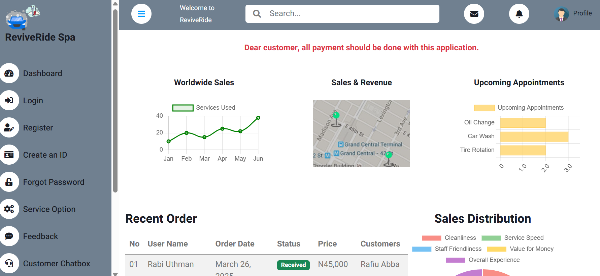

# ReviveRide

ReviveRide is a web-based application designed to provide car service management, location finding, payment processing, and customer interaction features. It includes a dashboard, AI-powered chat assistant, and various user-friendly interfaces.

## Project Structure

ReviveRide/ ├── chatbox.html ├── createID.html ├── feedback.html ├── forgotPassword.html ├── index.html ├── landingPage.html ├── locationFinder.html ├── notification.html ├── ourServices.html ├── payment.html ├── service.html ├── signin.html ├── signup.html ├── successful.html ├── css/ │ ├── bootstrap.min.css │ └── style.css ├── img/ │ ├── car-1281640_1280.jpg │ ├── google_icon.png │ ├── icons8-correct-48 1.png │ ├── logo_img.png │ ├── map_small.jpg │ ├── ReviveRide.png │ ├── testimonial-1.jpg │ ├── testimonial-2.jpg │ └── user.jpg ├── js/ │ └── main.js ├── lib/ │ ├── chart/ │ ├── easing/ │ ├── owlcarousel/ │ └── ... └── scss/

## Features

1. **Dashboard**: Overview of sales, revenue, and appointments ([index.html](index.html)).
2. **AI Chat Assistant**: Interactive chatbot for customer support ([chatbox.html](chatbox.html)).
3. **Location Finder**: Map-based location services ([locationFinder.html](locationFinder.html)).
4. **Payment Processing**: Secure payment interface ([payment.html](payment.html)).
5. **User Authentication**: Sign-in, sign-up, and password reset ([signin.html](signin.html), [signup.html](signup.html), [forgotPassword.html](forgotPassword.html)).
6. **Notifications**: Alerts and updates for users ([notification.html](notification.html)).
7. **Feedback**: Collect user feedback ([feedback.html](feedback.html)).
8. **Transaction History**: View past transactions ([service.html](service.html)).

## Image



## Installation

1. Clone the repository:
   ```bash
   git clone <repository-url>
   ```
2. Open the project in your preferred IDE (e.g., Visual Studio Code).

3. Launch the application by opening index.html in a web browser.

## Dependencies

- Bootstrap for responsive design.
- jQuery for DOM manipulation.
- Owl Carousel for carousels.
- Chart.js for data visualization.
- Mapbox for map services.

## Usage

- Navigate through the sidebar to access different features.
- Use the AI Chat Assistant for support.
- Manage payments and view transaction history.
- Locate services using the location finder.

## License

This project is licensed under the MIT License. See the LICENSE file for details.

## Contributing

Contributions are welcome! Please fork the repository and submit a pull request.

## Contact

For inquiries or support, please contact support@reviveride.com.

You can customize this further based on specific project details or requirements.
